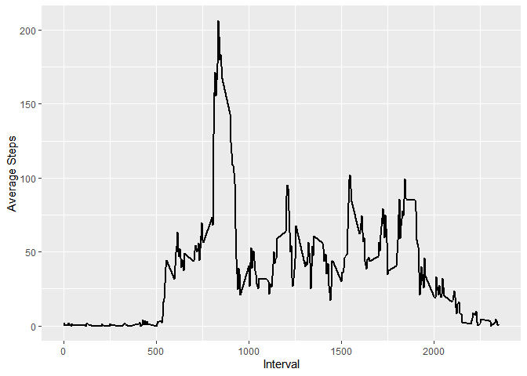
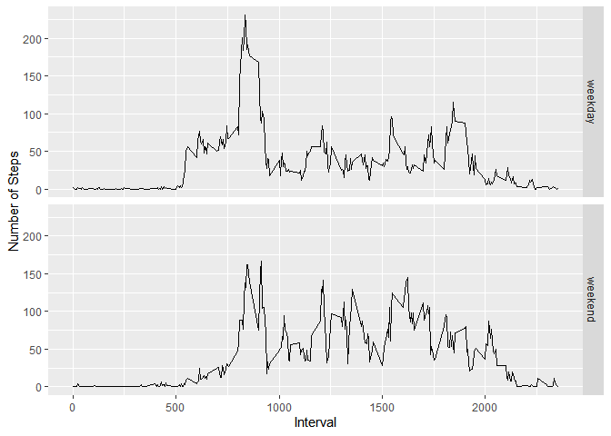

```r
library(tidyverse)
```

```
## -- Attaching packages ------------------------------------------------------------ tidyverse 1.3.0 --
```

```
## v ggplot2 3.3.0     v purrr   0.3.3
## v tibble  3.0.0     v dplyr   0.8.5
## v tidyr   1.0.2     v stringr 1.4.0
## v readr   1.3.1     v forcats 0.5.0
```

```
## -- Conflicts --------------------------------------------------------------- tidyverse_conflicts() --
## x dplyr::filter() masks stats::filter()
## x dplyr::lag()    masks stats::lag()
```

```r
library(lubridate)
```

```
## 
## Attaching package: 'lubridate'
```

```
## The following objects are masked from 'package:dplyr':
## 
##     intersect, setdiff, union
```

```
## The following objects are masked from 'package:base':
## 
##     date, intersect, setdiff, union
```
## Loading and preprocessing the data

```r
data <- tbl_df(read.csv("activity.csv"))
data <- data %>% mutate(date=as_date(date))
```

## What is mean total number of steps taken per day?

```r
tmp <- data %>% group_by(date) %>% summarize(sum(steps, na.rm=TRUE))
names(tmp) <- c("date","total_steps")
hist(tmp$total_steps, main="Daily Total Steps", xlab="Total Steps", breaks=5)
```

<!-- -->

```r
mean_steps <- mean(tmp$total_steps, na.rm = TRUE)
median_steps <- median(tmp$total_steps, na.rm = TRUE)
```
The mean number of steps is 9354.23 and the median number of steps is 10395.

## What is the average daily activity pattern?
Make a time series plot (i.e. type = "l") of the 5-minute interval (x-axis) and the average number of steps taken, averaged across all days (y-axis)

Which 5-minute interval, on average across all the days in the dataset, contains the maximum number of steps?


```r
data <- data %>% ungroup() %>% group_by(interval)
tmp <- summarize(data, mean(steps, na.rm = TRUE))
names(tmp) <- c("interval", "avgsteps")
ggplot(tmp, aes(interval, avgsteps)) + geom_line(size=0.8) + xlab("Interval") + ylab("Average Steps")
```

<!-- -->

```r
highest_interval <- top_n(tmp, 1, avgsteps)
```
The interval 835 has the highest average steps taken at 206.1698113.


## Imputing missing values
Note that there are a number of days/intervals where there are missing values (coded as NA). The presence of missing days may introduce bias into some calculations or summaries of the data.

1. Calculate and report the total number of missing values in the dataset (i.e. the total number of rows with NAs)


```r
total_na <- sum(is.na(data))
```
Total missing values are 2304

2. Devise a strategy for filling in all of the missing values in the dataset. The strategy does not need to be sophisticated. For example, you could use the mean/median for that day, or the mean for that 5-minute interval, etc.

Create a new dataset that is equal to the original dataset but with the missing data filled in.

**Strategy:** We shall simply use the mean of respective intervals to fill in for the NA values of the steps.

```r
impute.mean <- function(x) replace(x, is.na(x), mean(x, na.rm = TRUE))
data_imputed <- data %>% mutate(steps = as.integer(impute.mean(steps)))
```
3. Make a histogram of the total number of steps taken each day and Calculate and report the mean and median total number of steps taken per day. Do these values differ from the estimates from the first part of the assignment? What is the impact of imputing missing data on the estimates of the total daily number of steps?


```r
data_imputed <- ungroup(data_imputed) %>%
  group_by(date)
data_imputed <- data_imputed %>%
  mutate(daily_steps=sum(steps))
hist(data_imputed$daily_steps, breaks = 5, main="Imputed Total Daily Steps", xlab="Total Daily Steps")
```

<!-- -->

```r
imputed_steps_mean <- mean(data_imputed$daily_steps)
imputed_steps_median <- median(data_imputed$daily_steps)
```
For the imputed dataset the mean is 10749.77 and the median is 10641. While for the raw dataset the mean was 9354.23 and the median was 10395.

## Are there differences in activity patterns between weekdays and weekends?

```r
data_imputed <- data_imputed %>% mutate(day_type = ifelse(wday(date, label=TRUE) %in% c("Sat","Sun"), "weekend", "weekday"))

data_imputed <- data_imputed %>% 
  ungroup() %>% 
  mutate(day_type=as_factor(day_type))

tmp <- data_imputed %>% 
  group_by(day_type, interval) %>% 
  summarize(msteps= mean(steps))

ggplot(data=tmp) + 
  aes(x=interval, y=msteps) + 
  geom_line() + 
  facet_grid(rows=vars(day_type)) +
  ylab("Number of Steps") + 
  xlab("Interval")
```

<!-- -->


